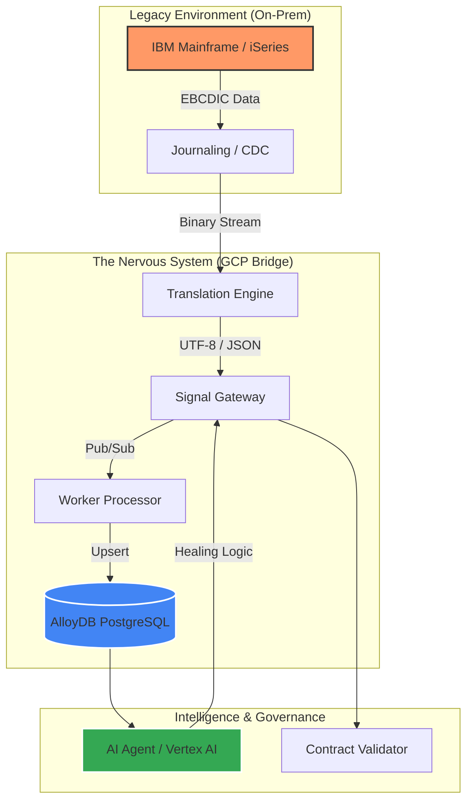

# ✈️ mia-dod-nervous-system-gcpgo-mainframe-bridge

**Enterprise Application Modernization Framework** *Mainframe-to-GCP Strangler Fig Implementation for High-Throughput Airline Systems*

---

## 🏛️ Architectural Overview

This repository implements a **"Nervous System"** pattern designed to decouple legacy C/C++ mainframe monoliths and migrate them into a Google Cloud native ecosystem. It focuses on solving the critical "Last Mile" problems of modernization: data encoding integrity (EBCDIC/UTF-8), high-availability state synchronization, and agentic AI observation.

### 🔄 The Modernization Flow

---

mia-dod-nervous-system-gcpgo-mainframe-bridge
├── 🤖 agent                   # AI logic & Prompt Engineering
│   ├── knowledge-base         # Domain-specific airline rules
│   └── prompts                # Agentic healing & refactoring prompts
├── 📡 api                     # Contract-first Definitions
│   ├── openapi                # REST Specs for Cloud services
│   └── proto                  # gRPC Specs for high-performance bridge
├── 💾 database                # Data Metabolism
│   ├── migrations             # DB2/VSAM to AlloyDB Schemas
│   ├── scripts/cdc-setup      # iSeries Journaling configuration
│   └── seeds                  # High-fidelity test data
├── 📜 docs                    # The Immune System (Compliance & ADRs)
│   ├── architecture           # ADRs & Roadmaps
│   └── compliance/nist-800-53 # FedRAMP High Alignment
├── 📦 pkg                     # Shared Organs (Internal Libraries)
│   ├── encoding-utils         # ⚡ EBCDIC to UTF-8 Mapper (CCSID aware)
│   ├── resilience             # 🛡️ Circuit Breakers & Retries
│   └── vertexai               # 🧠 Gemini Pro / Vertex AI Integration
├── ⚙️ services                # The Neurons (Go Microservices)
│   ├── ai-agent               # Autonomous monitoring & remediation
│   ├── translation-engine     # Critical data transformation middleware
│   ├── signal-gateway         # Ingress point for mainframe signals
│   └── worker-pubsub          # Asynchronous event processor
└── 🏗️ terraform               # The Skeleton (Infrastructure as Code)
    ├── environments           # Dev/Prod Multi-stage configs
    └── modules                # Reusable GCP Components (GKE, AlloyDB)
    
